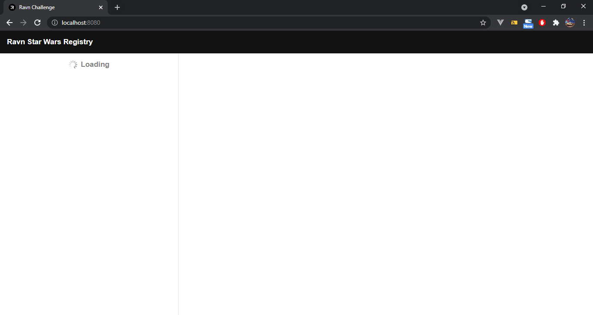
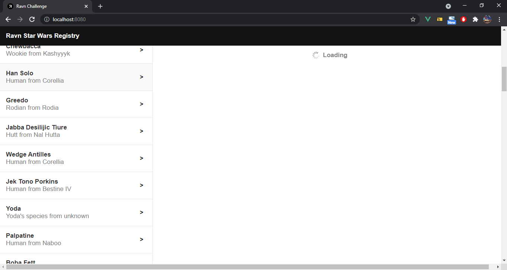

# Ravn Challenge - Efrain's Project

## Project setup
```
npm install
```

### Compiles and hot-reloads for development and test
```
npm run serve
```


## IMPORTANT

There are some drawbacks with the compatibility of some packages, this due to the poor implementation of Vue and Apollo. Outside of these warnings when installing and running the server, it works correctly.


A possible solution is use yarn instead of npm as package manager, having the latest versions may helps to avoid incompatibility
    
    Note: Production option is not optimized 


## TECHNOLOGIES

Basic
- JavaScript
- HTML & CSS
- GraphQL

Frameworks
- VueJS 3
- SASS
- Apollo, Vue-Apollo


## MAIN VIEW


## Loading people




## Loading person



## Show data person


## Falied loading people


## Falied loading data person

